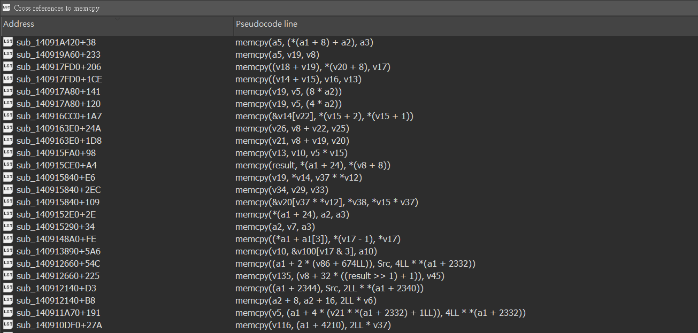

# LazyCross

---

## About the Plugin

An IDA Pro plugin that displays cross-references to functions or variables across the entire binary in Hex-Rays pseudocode.

---

## Installation

1. Download or clone this repository.
2. Copy `LazyCross.py` into your IDA plugins directory:
   - **Windows:**  
     `%APPDATA%\Hex-Rays\IDA Pro\plugins\`
   - **macOS/Linux:**  
     `~/IDA/plugins/`
3. Restart IDA.

---

## Usage

Press `Ctrl+X` on any function or variable from Hex-Rays to list its global cross-references, or right-click on the item and select LazyCross.

